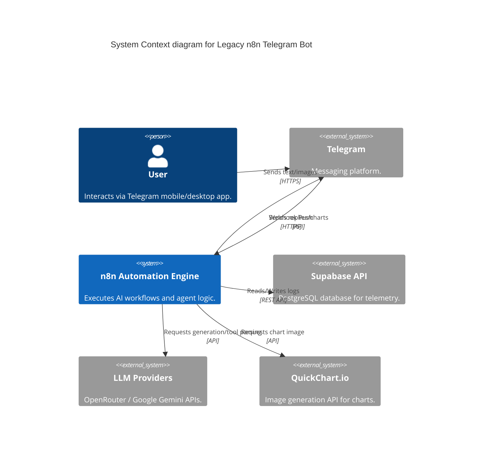
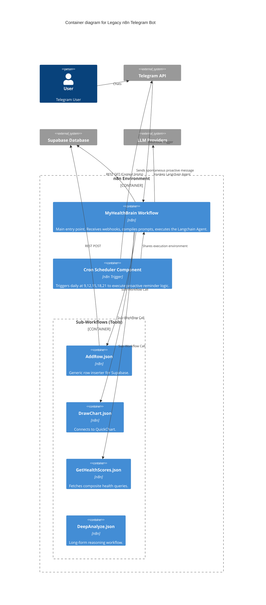

# Legacy System Architecture: n8n Telegram Bot

> **Note:** This document describes a legacy component of the NutriSync application. The active coaching agent is now built on the FastAPI/Google ADK stack.

## 1. High-Level Architecture Description
The legacy NutriSync Telegram Bot was completely decoupled from a custom web backend. Instead, it leveraged **n8n** (a workflow automation tool) as the central orchestrator. n8n acted as both the webhook receiver for Telegram events and the execution engine for Langchain-based AI agents. The state and long-term storage were maintained in the shared Supabase PostgreSQL database.

## 2. C4 Diagrams

### 2.1 Context Level
Shows the legacy Telegram bot interacting with the user and external APIs.

### 2.2 Container Level
Shows the high-level workflows inside the n8n environment.

## 3. Key Architectural Concepts

### Agent Structure
Unlike a standard code-based agent, this implementation utilized n8n's visual Node-based Langchain integration. The **Agent Node** was provided with:
1.  **Memory**: Windowed chat history buffer.
2.  **Tools**: A mix of direct nodes (e.g., Supabase GetMany nodes mapped specifically as Tools) and Sub-Workflow components (e.g., `AddRow` acting as a generic insertion function).
3.  **Prompting**: A massive, static system prompt string compiled at runtime referencing dynamic variables like current time `{{ $now }}` and `user_profile` targets.

### Scheduled Execution (Cron)
The `MyHealthBrain` workflow contained a disconnected parallel branch specifically for triggers. A Cron trigger fired multiple times a day. Custom JavaScript executed within a Code node determined the contextual relevance of the notification (e.g., adjusting for Ramadan/Fasting logic on Mondays and Thursdays) and conditionally aborted execution before sending the Telegram API request.
