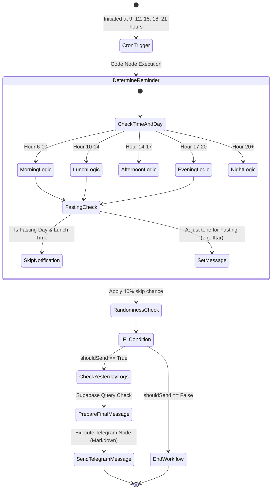
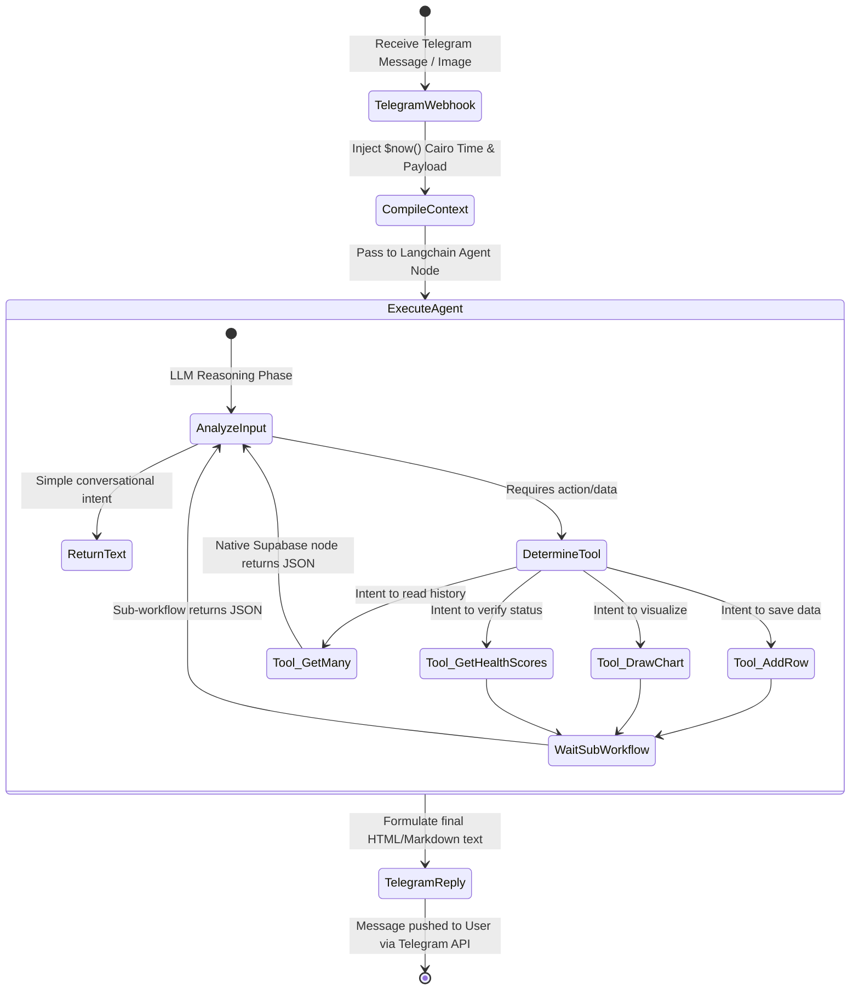

# Legacy State Diagrams: n8n Telegram Bot

> **Note:** This document describes a legacy component of the NutriSync application. The active coaching agent is now built on the FastAPI/Google ADK stack.

## 1. Telegram Scheduled Reminders Flow
Describes the proactive push notification logic executed inside the `MyHealthBrain.json` n8n workflow using Cron triggers.

## 2. n8n `MyHealthBrain` Agent Workflow
Describes the conversational pipeline from receiving a Telegram message to invoking tools and composing a reply.

