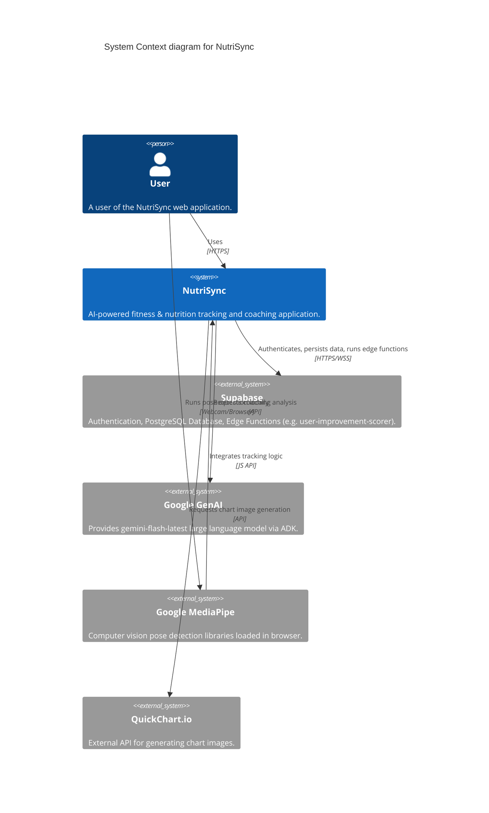
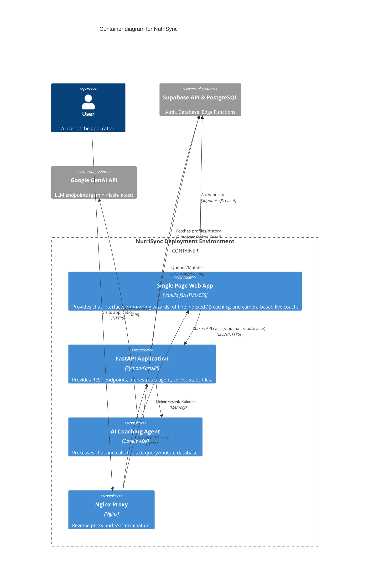

# NutriSync System Architecture

## 1. High-Level Architecture Description
NutriSync is a decoupled full-stack application. The frontend is a static web application built with vanilla JavaScript, HTML, and CSS. It communicates via REST API to a Python FastAPI backend. The backend manages the core business logic, user profiles, and orchestrates the Google GenAI agent (`google.adk`) which accesses various database tools. All state and user data are persisted in a Supabase PostgreSQL database. The application is containerized utilizing Docker Compose, with `nginx-proxy` handling reverse proxying and SSL termination.

## 2. C4 Diagrams

### 2.1 Context Level
Shows NutriSync interacting with the user and external systems.



### 2.2 Container Level
Shows the high-level deployable units of NutriSync.



### 2.3 Component Level (Backend API)
Shows the key structural internal modules of the FastAPI backend.

```mermaid
C4Component
  title Component diagram for the Backend Application

  Container_Boundary(api_bound, "Backend API (nutrisync_adk)") {
    Component(main_py, "Main Router (main.py)", "FastAPI", "Entry point, route definitions: /api/chat, /api/profile, /api/history, /api/chat/feedback, /health.")
    Component(runner_py, "ADK Runner (runners.py)", "Python", "Manages Google ADK Context, States, locks, and Agent execution.")
    
    Container_Boundary(tools_bound, "Tools Layer (tools/)") {
        Component(tool_workouts, "workouts.py", "Python", "Logs workouts, fetches history, gets schedule.")
        Component(tool_nutrition, "nutrition.py", "Python", "Logs meals, fetches history, estimates macros.")
        Component(tool_bodycomp, "body_comp.py", "Python", "Logs weight/bf/hr, updates profile.")
        Component(tool_sleep, "sleep.py", "Python", "Logs sleep duration and stages.")
        Component(tool_charts, "charts.py", "Python", "Calls QuickChart.io.")
        Component(tool_search, "web_search.py", "Python", "Google search.")
        Component(tool_notes, "context_notes.py", "Python", "Manages persistent context notes.")
        Component(tool_utils, "utils.py", "Python", "Database client, time logic, get_health_scores.")
    }
    
    Component(context_svc, "Context Service (local_context.py)", "Python", "Fetches dynamic user data (profile, goals, notes) in parallel for the prompt.")
    Component(history_svc, "History Service (history_service.py)", "Python", "Manages dual-write chat/tool history and retrieval.")
  }

  System_Ext(db, "Supabase DB", "PostgreSQL")
  System_Ext(edge_fn, "Supabase Edge Functions", "user-improvement-scorer")
  System_Ext(genai, "GenAI API", "REST API")

  Rel(main_py, runner_py, "Delegates chat requests")
  Rel(runner_py, context_svc, "Loads pre-prompt context")
  Rel(runner_py, history_svc, "Logs messages/tool payloads")
  Rel(runner_py, genai, "Sends prompt + tools")
  Rel(genai, runner_py, "Triggers Tool execution")
  Rel(runner_py, tool_workouts, "Executes requested tool")
  Rel(runner_py, tool_nutrition, "Executes requested tool")
  Rel(runner_py, tool_charts, "Executes requested tool")
  Rel(runner_py, tool_utils, "Executes get_health_scores")
  
  Rel(tools_bound, db, "Reads/Writes data via Supabase")
  Rel(tool_utils, edge_fn, "Invokes user-improvement-scorer via supabase functions invoke")
  Rel(history_svc, db, "Reads/Writes history")
  Rel(context_svc, db, "Reads active profiles, notes, daily_goals")
  Rel(main_py, db, "Reads/Writes profiles and 1RM records directly")
```

## 3. Internal Component Breakdown

### Frontend (Static Files in `nutrisync_adk/static/`)
- **`index.html`**: The single HTML shell, managing layout overlays (Auth, Chat View, Onboarding Wizard, Live Coach).
- **`script.js`**: Controls UI state transitions, API network calls to FastAPI, markdown rendering (KaTeX + Marked), IndexedDB local caching (`ChatCache`), message feedback UI, and Supabase Auth session management.
- **`workout_coach.js`**: Integrates `MediaPipe/pose` library via camera stream to track angles and repetititons locally. Implements SOLID principles via `CameraManager`, `PoseEstimationService`, `UIRenderer`, `ExerciseEngine`, and specific profiles (`SquatProfile`, `PushupProfile`, `PullProfile`). Features dynamic range calibration and cross-contamination filtering.
- **`style.css`**: Provides the premium Google Glassmorphism UI styling.

### Backend Services (`nutrisync_adk/`)
- **Main (`main.py`)**: Responsible for API route definitions (`/api/chat`, `/api/profile`, `/api/history/{guest_id}`, `/api/chat/feedback`, `/health`) and offline calculation of physiological formulas (Mifflin-St Jeor equation for macros/TDEE). Handles base64 data URI image decoding.
- **Runners (`runners.py`)**: Responsible for connecting the FastAPI requests to the ADK Agent, managing asynchronous database sessions utilizing `DatabaseSessionService`, and applying per-user `asyncio.Lock` mechanisms to prevent race conditions during ADK state updates.
- **Agent Sandbox (`agents/coach.py`)**: Agent configuration mapping the `gemini-flash-latest` model and 16 distinct tools registered to the `coach_agent`.
- **Context & History Services (`services/`)**: `local_context.py` loads `user_profile`, `daily_goals`, and `persistent_context` simultaneously via `asyncio.gather`. `history_service.py` manages chronological chat and tool history dual-writes.
- **Tools (`tools/`)**: Modular python files encapsulating domain-specific logic. They use `get_current_functional_time()` in `utils.py` to correctly map late-night entries (e.g., 2 AM) to the functional prior calendar day. `charts.py` builds fully tailored Chart.js configurations and converts them to images via QuickChart.

### Database Layer (Supabase)
- Uses **PostgreSQL** configured with **RLS (Row-Level Security)** enforcing isolated tenant access via JWT token exchange. Tables map tightly to backend fetching (e.g., `user_profile`, `daily_goals`, `user_1rm_records`, `workout_splits`, `persistent_context`).
- Connection pooling uses `asyncpg` with zero statement caching (`prepared_statement_cache_size=0`) to ensure compatibility with Supabase's `Supavisor` connection pooler.
- **Edge Functions** execute intensive or cron-triggered logical operations separately (e.g. `user-improvement-scorer`), saving results to `scores_snapshots` and domain-specific `*_improvement_snapshots` tables.
- **ADK Internals** manage Google ADK execution state via tables such as `sessions`, `app_states`, and `events`.
