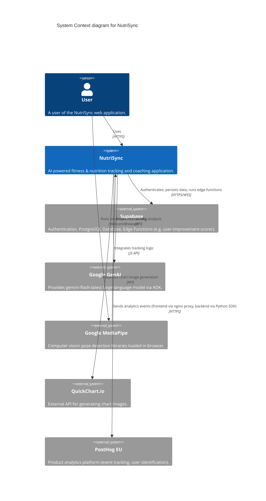
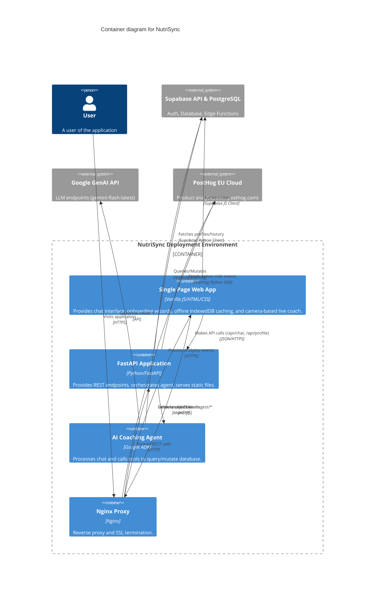

# NutriSync System Architecture

## 1. High-Level Architecture Description
NutriSync is a decoupled full-stack application. The frontend is a static web application built with vanilla JavaScript, HTML, and CSS. It communicates via REST API to a Python FastAPI backend. The backend manages the core business logic, user profiles, and orchestrates the Google GenAI agent (`google.adk`) which accesses various database tools. All state and user data are persisted in a Supabase PostgreSQL database. The application is containerized utilizing Docker Compose, with `nginx-proxy` handling reverse proxying and SSL termination.

## 2. C4 Diagrams

### 2.1 Context Level
Shows NutriSync interacting with the user and external systems.



### 2.2 Container Level
Shows the high-level deployable units of NutriSync.



### 2.3 Component Level (Backend API)
Shows the key structural internal modules of the FastAPI backend.

```mermaid
C4Component
  title Component diagram for the Backend Application

  Container_Boundary(api_bound, "Backend API (nutrisync_adk)") {
    Component(main_py, "Main Router (main.py)", "FastAPI", "Entry point, route definitions: /api/chat, /api/profile, /api/history, /api/chat/feedback, /api/workout-plan, /api/progress, /api/muscle-volume, /health.")
    Component(runner_py, "ADK Runner (runners.py)", "Python", "Manages Google ADK Context, States (7 state_delta keys), locks, and Agent execution.")
    
    Container_Boundary(tools_bound, "Tools Layer (tools/)") {
        Component(tool_workouts, "workouts.py", "Python", "Logs workouts (returns workout_log_id), fetches history, gets schedule. NEW: generate_workout_plan, get_workout_plan, log_exercise_sets (PR detection + auto 1RM update), get_exercise_history, get_progressive_overload_summary. Science constants: VOLUME_TABLE, GOAL_REP_RANGES, SPLIT_MUSCLE_MAP (16 split types incl. Arnold Split).")
        Component(tool_nutrition, "nutrition.py", "Python", "Logs meals, fetches history, estimates macros.")
        Component(tool_bodycomp, "body_comp.py", "Python", "Logs weight/bf/hr, updates profile.")
        Component(tool_sleep, "sleep.py", "Python", "Logs sleep duration and stages.")
        Component(tool_charts, "charts.py", "Python", "Calls QuickChart.io.")
        Component(tool_search, "web_search.py", "Python", "Google search.")
        Component(tool_notes, "context_notes.py", "Python", "Manages persistent context notes.")
        Component(tool_utils, "utils.py", "Python", "Database client, time logic, get_health_scores.")
    }
    
    Component(context_svc, "Context Service (local_context.py)", "Python", "Fetches dynamic user data (profile, goals, notes, equipment, 1RM records, workout plan) in parallel (6 async fetchers) for the prompt.")
    Component(history_svc, "History Service (history_service.py)", "Python", "Manages dual-write chat/tool history and retrieval.")
  }

  System_Ext(db, "Supabase DB", "PostgreSQL")
  System_Ext(edge_fn, "Supabase Edge Functions", "user-improvement-scorer")
  System_Ext(genai, "GenAI API", "REST API")

  Rel(main_py, runner_py, "Delegates chat requests")
  Rel(runner_py, context_svc, "Loads pre-prompt context")
  Rel(runner_py, history_svc, "Logs messages/tool payloads")
  Rel(runner_py, genai, "Sends prompt + tools")
  Rel(genai, runner_py, "Triggers Tool execution")
  Rel(runner_py, tool_workouts, "Executes requested tool")
  Rel(runner_py, tool_nutrition, "Executes requested tool")
  Rel(runner_py, tool_charts, "Executes requested tool")
  Rel(runner_py, tool_utils, "Executes get_health_scores")
  
  Rel(tools_bound, db, "Reads/Writes data via Supabase")
  Rel(tool_utils, edge_fn, "Invokes user-improvement-scorer via supabase functions invoke")
  Rel(history_svc, db, "Reads/Writes history")
  Rel(context_svc, db, "Reads active profiles, notes, daily_goals, user_equipment, user_1rm_records, workout_plan_exercises")
  Rel(main_py, db, "Reads/Writes profiles, 1RM records, user equipment, workout plans, exercise logs, and muscle volume directly")
```

## 3. Internal Component Breakdown

### Frontend (Static Files in `nutrisync_adk/static/`)
- **`index.html`**: The single HTML shell, managing layout overlays (Auth, Chat View, Onboarding Wizard, Live Coach, Workout Tracker).
- **`script.js`**: Controls UI state transitions, API network calls to FastAPI, markdown rendering (KaTeX + Marked), IndexedDB local caching (`ChatCache`), message feedback UI, Supabase Auth session management, and the `WorkoutTracker` frontend module (Plan tab grouping, Progress tab charts via Chart.js, Volume Heatmap tab).
- **`workout_coach.js`**: Integrates `MediaPipe/pose` library via camera stream to track angles and repetititons locally. Implements SOLID principles via `CameraManager`, `PoseEstimationService`, `UIRenderer`, `ExerciseEngine`, and specific profiles (`SquatProfile`, `PushupProfile`, `PullProfile`). Features dynamic range calibration and cross-contamination filtering.
- **`style.css`**: Provides the premium Google Glassmorphism UI styling, including specialized styling for the Workout Tracker tabs, exercise cards, and progress bars.

### Analytics (PostHog)
NutriSync uses **PostHog** (EU Cloud) for product analytics with a dual-layer architecture:

#### Frontend (JS SDK)
- Loaded via `index.html` Jinja2 template (``).
- Configured with `api_host: '/ingest'` to route all events through the first-party nginx reverse proxy, bypassing adblockers.
- Auto-captures: pageviews, pageleaves, and autocapture (clicks, inputs).
- **Custom events** captured in `script.js`:
  - `user_signed_up` / `user_signed_in` — authentication actions.
  - `chat_message_sent` — with `message_length`, `has_image`.
  - `chat_message_error` — on API failures.
  - `message_feedback_submitted` — with `feedback_value`, `message_id`.
  - `live_coach_started` / `live_coach_stopped` — with `exercise` and `duration_seconds`.
  - `live_coach_exercise_logged` — with `exercise`, `reps`, `good_form_pct`.
  - `onboarding_step_viewed` / `onboarding_completed` — wizard funnel tracking.
  - `profile_settings_opened` — settings engagement.
  - `workout_tracker_opened` / `workout_tracker_tab_viewed` — tracker engagement.

#### Backend (Python SDK)
- Singleton client in `services/analytics.py` using `posthog` Python package.
- Configured via `POSTHOG_API_KEY` and `POSTHOG_HOST` env vars (defaults to `https://eu.i.posthog.com`).
- Graceful degradation: missing API key or package disables analytics without breaking the app.
- Flushed on shutdown via `posthog_shutdown()` in FastAPI `on_shutdown` event.
- **Server-side events** captured:
  - `api_chat_processed` (in `main.py`) — `message_length`, `has_image`, `response_length`, `has_chart`, `latency_ms`.
  - `api_feedback_submitted` (in `main.py`) — `feedback_value`, `message_id`.
  - `api_profile_saved` (in `main.py`) — profile save confirmation.
  - `api_live_coach_logged` (in `main.py`) — live coach exercise data persisted.
  - `ai_tool_called` (in `runners.py`) — per-tool invocation tracking with `tool_name`, `has_args`.
  - `ai_agent_run_completed` (in `runners.py`) — full run metrics: `context_load_ms`, `total_duration_ms`, `tool_call_count`, `tools_used`, `has_image_input`, `has_chart_output`, `response_length`.
- **User identification**: `posthog_identify()` links Supabase UUID to person properties.

#### Nginx Reverse Proxy (Adblocker Bypass)
The frontend JS SDK sends events to `/ingest/*` on the same domain (`bot.ziadamer.com`), which nginx proxies to PostHog EU:
- `/ingest/static/*` → `https://eu-assets.i.posthog.com/static/` (JS SDK bundle, plugins).
- `/ingest/*` → `https://eu.i.posthog.com/` (event ingestion, decide, config endpoints).
- Configured in `nginx/vhost.d/bot.ziadamer.com` (server-level include for `nginxproxy/nginx-proxy`).
- Uses `proxy_ssl_server_name on` + `proxy_ssl_verify off` for upstream TLS, `proxy_http_version 1.1` for keepalive.
- Passes `X-Forwarded-For` and `X-Forwarded-Host` for accurate geo-IP attribution.

### Backend Services (`nutrisync_adk/`)
- **Main (`main.py`)**: Responsible for API route definitions (`/api/chat`, `/api/profile`, `/api/history/{guest_id}`, `/api/chat/feedback`, `/api/workout-plan/{user_id}`, `/api/progress/{user_id}`, `/api/muscle-volume/{user_id}`, `/health`) and offline calculation of physiological formulas (Mifflin-St Jeor equation for macros/TDEE). Handles base64 data URI image decoding. The 3 new workout endpoints query `workout_plan_exercises`, `exercise_logs`, and the `get_exercise_progress`/`get_weekly_muscle_volume` DB functions directly. **Workout split handling** uses an upsert pattern: `POST /api/profile` reuses the existing active split UUID when one exists (updating name and replacing `split_items`), and only creates a new split row on first-time onboarding — this preserves `workout_plan_exercises.split_id` FK integrity across profile saves.
- **Runners (`runners.py`)**: Responsible for connecting the FastAPI requests to the ADK Agent, managing asynchronous database sessions utilizing `DatabaseSessionService`, and applying per-user `asyncio.Lock` mechanisms to prevent race conditions during ADK state updates. Uses `state_delta` parameter in `run_async()` (rather than direct `session.state` mutation) to inject 7 dynamic context keys (user_profile, daily_totals, current_time, active_notes, equipment_list, one_rm_records, workout_plan) into the ADK session state per the official ADK best practice for `DatabaseSessionService`. The `_build_instruction` InstructionProvider callback substitutes all 7 `{placeholder}` tokens in the system prompt template.
- **Agent Sandbox (`agents/coach.py`)**: Agent configuration mapping the `gemini-flash-latest` model and 21 distinct tools registered to the `coach_agent`. The 5 newest tools cover workout plan generation, set-level exercise logging with PR detection, exercise history retrieval, and progressive overload trend analysis.
- **Context & History Services (`services/`)**: `local_context.py` loads `user_profile`, `daily_goals`, `persistent_context`, `user_equipment`, `user_1rm_records`, and `workout_plan_exercises` simultaneously via `asyncio.gather` (6 parallel fetchers). `history_service.py` manages chronological chat and tool history dual-writes.
- **Tools (`tools/`)**: Modular python files encapsulating domain-specific logic. They use `get_current_functional_time()` in `utils.py` to correctly map late-night entries (e.g., 2 AM) to the functional prior calendar day. `charts.py` builds fully tailored Chart.js configurations and converts them to images via QuickChart. `workouts.py` contains science-based constants (`VOLUME_TABLE` with Schoenfeld dose-response volume landmarks per experience level, `GOAL_REP_RANGES` with load %1RM per goal, `SPLIT_MUSCLE_MAP` with 16 split types including Arnold Split) and implements structured superset support via `superset_group`.

### Database Layer (Supabase)
- Uses **PostgreSQL** configured with **RLS (Row-Level Security)** enforcing isolated tenant access via JWT token exchange. Tables map tightly to backend fetching (e.g., `user_profile`, `daily_goals`, `user_1rm_records`, `workout_splits`, `persistent_context`, `user_equipment`, `workout_plan_exercises`, `exercise_logs`).
- **Workout Plan Tables** (new): `workout_plan_exercises` stores the AI-prescribed workout plan per split day (exercise name, type, target muscles, sets, rep range, load %1RM, rest, superset_group, notes). `exercise_logs` stores actual set-by-set performance (weight × reps × RPE, with auto-computed `volume_load` via GENERATED ALWAYS AS STORED column, `is_pr` flags, and optional FK to `workout_logs` via UUID). Both tables have full RLS + service_role policies and 7 optimized indexes.
- **DB Helper Functions**: `estimated_1rm()` (Epley formula, IMMUTABLE), `get_exercise_progress()` (weekly e1RM/volume trends grouped by ISO week, STABLE), `get_weekly_muscle_volume()` (sets per muscle group via exercise_logs ↔ workout_plan_exercises join with UNNEST on target_muscles array, STABLE).
- Connection pooling uses `asyncpg` with zero statement caching (`prepared_statement_cache_size=0`) to ensure compatibility with Supabase's `Supavisor` connection pooler.
- **Edge Functions** execute intensive or cron-triggered logical operations separately (e.g. `user-improvement-scorer`), saving results to `scores_snapshots` and domain-specific `*_improvement_snapshots` tables.
- **ADK Internals** manage Google ADK execution state via tables such as `sessions`, `app_states`, and `events`.
