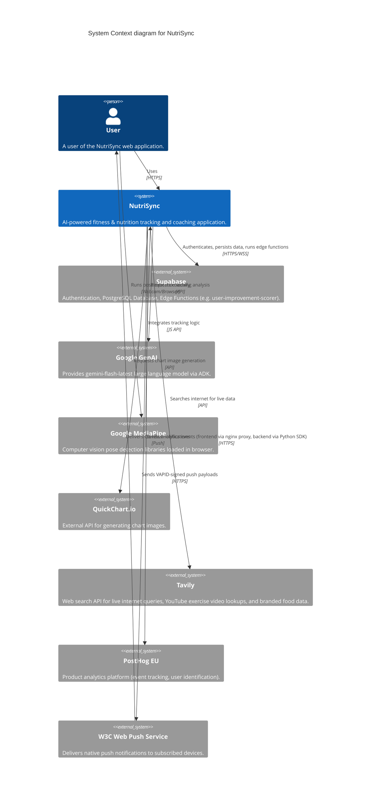
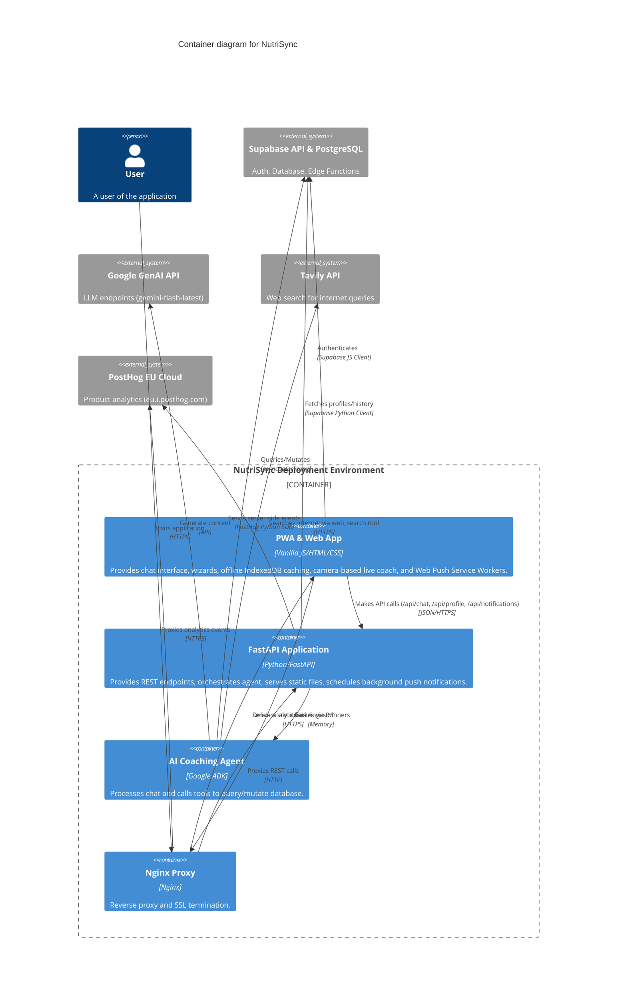

# NutriSync System Architecture

## 1. High-Level Architecture Description
NutriSync is a decoupled full-stack application. The frontend is a static web application built with vanilla JavaScript, HTML, and CSS. It communicates via REST API to a Python FastAPI backend. The backend manages the core business logic, user profiles, and orchestrates the Google GenAI agent (`google.adk`) which accesses various database tools. All state and user data are persisted in a Supabase PostgreSQL database. The application is containerized utilizing Docker Compose, with `nginx-proxy` handling reverse proxying and SSL termination.

## 2. C4 Diagrams

### 2.1 Context Level
Shows NutriSync interacting with the user and external systems.



### 2.2 Container Level
Shows the high-level deployable units of NutriSync.



### 2.3 Component Level (Backend API)
Shows the key structural internal modules of the FastAPI backend.

```mermaid
C4Component
  title Component diagram for the Backend Application

  Container_Boundary(api_bound, "Backend API (nutrisync_adk)") {
    Component(main_py, "Main Router (main.py)", "FastAPI", "Entry point, route definitions: /api/chat, /api/profile, /api/history/{guest_id}, /api/chat/feedback, /api/live-coach/log, /api/workout-plan/{user_id}, /api/progress/{user_id}, /api/muscle-volume/{user_id}, /health, /, /favicon.ico. Serves index.html via Jinja2 template rendering.")
    Component(runner_py, "ADK Runner (runners.py)", "Python", "Manages Google ADK Context, States (10 state_delta keys), locks, language-aware prompt loading, and Agent execution.")
    
    Container_Boundary(tools_bound, "Tools Layer (tools/)") {
        Component(tool_workouts, "workouts.py", "Python", "Logs workouts (returns workout_log_id), fetches history, gets schedule. NEW: generate_workout_plan, get_workout_plan, log_exercise_sets (PR detection + auto 1RM update), get_exercise_history, get_progressive_overload_summary. Science constants: VOLUME_TABLE, GOAL_REP_RANGES, SPLIT_MUSCLE_MAP (16 split types incl. Arnold Split).")
        Component(tool_nutrition, "nutrition.py", "Python", "Logs meals, fetches history, estimates macros.")
        Component(tool_bodycomp, "body_comp.py", "Python", "Logs weight/bf/hr, updates profile.")
        Component(tool_sleep, "sleep.py", "Python", "Logs sleep duration and stages.")
        Component(tool_charts, "charts.py", "Python", "Calls QuickChart.io.")
        Component(tool_search, "web_search.py", "Python", "Tavily-powered web search for internet queries, YouTube exercise videos, branded food data, and real-time fact verification.")
        Component(tool_notes, "context_notes.py", "Python", "Manages persistent context notes.")
        Component(tool_utils, "utils.py", "Python", "Database client, time logic, get_health_scores.")
    }
    
    Component(context_svc, "Context Service (local_context.py)", "Python", "Fetches dynamic user data in parallel (7 async fetchers) for the prompt.")
    Component(history_svc, "History Service (history_service.py)", "Python", "Manages dual-write chat/tool history and retrieval.")
    Component(notif_svc, "Notification Service (notifications.py)", "Python & pywebpush", "Runs APScheduler heuristics (Morning, Afternoon, Evening, Night, Bi-Weekly Body Comp) to dispatch Push Notifications.")
  }

  System_Ext(db, "Supabase DB", "PostgreSQL")
  System_Ext(edge_fn, "Supabase Edge Functions", "user-improvement-scorer")
  System_Ext(genai, "GenAI API", "REST API")

  Rel(main_py, runner_py, "Delegates chat requests")
  Rel(runner_py, context_svc, "Loads pre-prompt context")
  Rel(runner_py, history_svc, "Logs messages/tool payloads")
  Rel(runner_py, genai, "Sends prompt + tools")
  Rel(genai, runner_py, "Triggers Tool execution")
  Rel(runner_py, tool_workouts, "Executes requested tool")
  Rel(runner_py, tool_nutrition, "Executes requested tool")
  Rel(runner_py, tool_charts, "Executes requested tool")
  Rel(runner_py, tool_utils, "Executes get_health_scores")
  
  Rel(tools_bound, db, "Reads/Writes data via Supabase")
  Rel(tool_utils, edge_fn, "Invokes user-improvement-scorer via supabase functions invoke")
  Rel(history_svc, db, "Reads/Writes history")
  Rel(context_svc, db, "Reads active profiles, notes, daily_goals, user_equipment, user_1rm_records, workout_plan_exercises, workout_splits/split_items")
  Rel(main_py, db, "Reads/Writes profiles, 1RM records, user equipment, workout plans, exercise logs, and muscle volume directly")
```

## 3. Internal Component Breakdown

### Frontend (Static Files in `nutrisync_adk/static/`)
- **`manifest.json` & `service-worker.js`**: PWA implementation enabling installability and background `push` event listening. The Service Worker receives encrypted messaging (VAPID payload) and displays native OS notifications via `self.registration.showNotification`.
- **`index.html`**: The single HTML shell, managing layout overlays (Auth, Chat View, Wizard, Live Coach, Workout Tracker, Push Notification Opt-In). All visible text elements are tagged with `data-i18n`. Includes RTL direction mapping.
- **`script.js`**: Controls UI state transitions, API network calls, markdown rendering (KaTeX + Marked), IndexedDB local caching (`ChatCache`), message feedback UI, Supabase Auth session management, Push Notification Subscriptions (`initPushNotifications`), and the `WorkoutTracker` frontend module.
- **`workout_coach.js`**: Integrates `MediaPipe/pose` library via camera stream to track angles and repetitions locally.
- **`i18n.js`** & **`locales/*.json`**: Client-side internationalization engine parsing English (`en`) and Arabic (`ar`) translations for ~311 string keys (including Notification UI errors).
- **`style.css`**: Provides the premium Google Glassmorphism UI styling, RTL physical→logical properties overrides, and specialized custom Notification Opt-In modal logic designed to secure the user gesture token prior to calling the native browser permission prompt.

### Analytics (PostHog)
NutriSync uses **PostHog** (EU Cloud) for product analytics with a dual-layer architecture:

#### Frontend (JS SDK)
- Loaded via `index.html` Jinja2 template (``).
- Configured with `api_host: '/ingest'` to route all events through the first-party nginx reverse proxy, bypassing adblockers.
- Auto-captures: pageviews, pageleaves, and autocapture (clicks, inputs).
- **Custom events** captured in `script.js`:
  - `user_signed_up` / `user_signed_in` — authentication actions.
  - `chat_message_sent` — with `message_length`, `has_image`.
  - `chat_message_error` — on API failures.
  - `message_feedback_submitted` — with `feedback_value`, `message_id`.
  - `live_coach_started` / `live_coach_stopped` — with `exercise` and `duration_seconds`.
  - `live_coach_exercise_logged` — with `exercise`, `reps`, `good_form_pct`.
  - `onboarding_step_viewed` / `onboarding_completed` — wizard funnel tracking.
  - `profile_settings_opened` — settings engagement.
  - `workout_tracker_opened` / `workout_tracker_tab_viewed` — tracker engagement.

#### Backend (Python SDK)
- Singleton client in `services/analytics.py` using `posthog` Python package.
- Configured via `POSTHOG_API_KEY` and `POSTHOG_HOST` env vars (defaults to `https://eu.i.posthog.com`).
- Graceful degradation: missing API key or package disables analytics without breaking the app.
- Flushed on shutdown via `posthog_shutdown()` in FastAPI `on_shutdown` event.
- **Server-side events** captured:
  - `api_chat_processed` (in `main.py`) — `message_length`, `has_image`, `response_length`, `has_chart`, `latency_ms`.
  - `api_feedback_submitted` (in `main.py`) — `feedback_value`, `message_id`.
  - `api_profile_saved` (in `main.py`) — profile save confirmation.
  - `api_live_coach_logged` (in `main.py`) — live coach exercise data persisted.
  - `ai_tool_called` (in `runners.py`) — per-tool invocation tracking with `tool_name`, `has_args`.
  - `ai_agent_run_completed` (in `runners.py`) — full run metrics: `context_load_ms`, `total_duration_ms`, `tool_call_count`, `tools_used`, `has_image_input`, `has_chart_output`, `response_length`.
- **User identification**: `posthog_identify()` links Supabase UUID to person properties.

#### Nginx Reverse Proxy (Adblocker Bypass)
The frontend JS SDK sends events to `/ingest/*` on the same domain (`bot.ziadamer.com`), which nginx proxies to PostHog EU:
- `/ingest/static/*` → `https://eu-assets.i.posthog.com/static/` (JS SDK bundle, plugins).
- `/ingest/*` → `https://eu.i.posthog.com/` (event ingestion, decide, config endpoints).
- Configured in `nginx/vhost.d/bot.ziadamer.com` (server-level include for `nginxproxy/nginx-proxy`).
- Uses `proxy_ssl_server_name on` + `proxy_ssl_verify off` for upstream TLS, `proxy_http_version 1.1` for keepalive.
- Passes `X-Forwarded-For` and `X-Forwarded-Host` for accurate geo-IP attribution.

### Backend Services (`nutrisync_adk/`)
- **Main (`main.py`)**: Responsible for API route definitions (`/api/chat`, `/api/profile`, `/api/history/{guest_id}`, `/api/notifications/subscribe`, `/api/notifications/test-trigger`) and offline calculation of physiological formulas. Hosts the `APScheduler` loop running background cron jobs for Morning/Afternoon/Evening/Night and Bi-Weekly notification heuristical checks. Serves `index.html` via **Jinja2** template. 
- **Notification Service (`services/notifications.py`)**: Interacts securely with the W3C Push Service utilizing VAPID authentication keys (from `.env`), calculating personalized gaps in `sleep_logs`, `nutrition_logs`, `body_composition_logs`, and dynamically polling `workout_logs` matched against `split_structure` to dispatch personalized push messages effectively bypassing LLM-inference costs.
- **Runners (`runners.py`)**: Responsible for connecting the FastAPI requests to the ADK Agent, managing asynchronous database sessions utilizing `DatabaseSessionService`, and injecting **10 dynamic context keys**.
- **Agent Sandbox (`agents/coach.py`)**: Agent configuration mapping the `gemini-flash-latest` model and 21 distinct tools registered to the `coach_agent`.
- **Context & History Services (`services/`)**: `local_context.py` loads user graphs. `history_service.py` records history events.
- **Tools (`tools/`)**: Modular python files encapsulating domain-specific logic. They use `get_current_functional_time()` in `utils.py` to correctly map late-night entries (e.g., 2 AM) to the functional prior calendar day.
- **System Prompts (`prompts/`)**: Contains language-specific AI system prompt templates.
  - `system.md` — English system prompt with 17 protocols (including Protocol 17: Exercise Video Demo Protocol for YouTube exercise links via `web_search`). Template placeholders: `{user_profile}`, `{daily_totals}`, `{current_time}`, `{active_notes}`, `{equipment_list}`, `{one_rm_records}`, `{split_structure}`, `{workout_plan}`, `{coach_name}`.
  - `system_ar.md` — Full Arabic (Egyptian dialect) system prompt translation with identical 17 protocols and template placeholders. Instructs the AI to always respond in Arabic (Egyptian dialect).

### Internationalization & RTL Architecture
NutriSync supports full **internationalization (i18n)** and **Right-to-Left (RTL)** rendering for Arabic, with English as the default language. The system spans frontend, backend, and database layers.

#### Frontend i18n Layer
- **Engine** (`i18n.js`): Self-contained IIFE that initializes before other scripts. Detects language from `localStorage` → browser language → default. Loads English as permanent fallback, then loads the active locale. Scans and translates the DOM on load and on every language switch. Dispatches `languagechange` CustomEvent.
- **Locale Files** (`locales/en.json`, `locales/ar.json`): Flat key-value JSON files (311 keys each) covering every visible UI string, organized by namespace (header, chat, auth, coach, tracker, wizard, feedback, profile, equipment, muscles, splits, units, errors).
- **DOM Integration**: All visible text in `index.html` uses `data-i18n`, `data-i18n-placeholder`, `data-i18n-title`, or `data-i18n-html` attributes. Dynamic strings in `script.js` (~95+ calls) and `workout_coach.js` (~30 calls) use `window.t(key, params)`.
- **CSS RTL**: 19 physical-to-logical property conversions in `style.css` (e.g., `margin-left` → `margin-inline-start`). `[dir=rtl]` selector overrides for font-family (Cairo) and form control background-position flip. `<html dir="rtl" lang="ar">` is set automatically by `i18n.js`.
- **Canvas RTL** (`workout_coach.js`): `drawOverlayText` sets `ctx.direction = getDir()` and adjusts `textAlign` and X coordinates for RTL mirroring. Uses Cairo font when direction is RTL.
- **Chart.js RTL** (`script.js`): All charts conditionally apply `x.reverse = true`, `y.position = 'right'`, and `tooltip.rtl = true` / `legend.rtl = true` when `getDir() === 'rtl'`.
- **Language Switcher**: `<select id="lang-switcher">` in the HTML header, bound in `script.js` to call `window.setLang(value)` on change.

#### Backend i18n Layer
- **Language-Aware Prompt Loading**: `runners.py` maintains a `_PROMPT_TEMPLATES: Dict[str, str]` cache. `_load_prompt_template(lang)` resolves to `prompts/system.md` for English or `prompts/system_{lang}.md` for other languages (e.g., `system_ar.md`), with automatic English fallback.
- **Language Propagation**: `ChatRequest.language` and `ProfileRequest.language` fields (default `"en"`) carry the user's language preference from frontend to backend. The `language` value is injected into `state_updates` and ultimately into `state_delta` for the ADK session, where `_build_instruction` reads it to select the correct prompt template.
- **Error Code i18n**: `HTTPException` detail strings use i18n error code keys (e.g., `"error.reps_zero"`, `"error.missing_exercise_name"`) instead of English text, allowing the frontend to map them to localized messages via `t()`.

#### Database i18n Layer
- **Migration 014** (`014_add_language.sql`): Adds `language TEXT NOT NULL DEFAULT 'en'` column to `user_profiles` for persisting user language preference across sessions.

### Database Layer (Supabase)
- Uses **PostgreSQL** configured with **RLS (Row-Level Security)** enforcing isolated tenant access via JWT token exchange. Tables map tightly to backend fetching (e.g., `user_profile`, `daily_goals`, `user_1rm_records`, `workout_splits`, `persistent_context`, `user_equipment`, `workout_plan_exercises`, `exercise_logs`).
- **Workout Plan Tables** (new): `workout_plan_exercises` stores the AI-prescribed workout plan per split day (exercise name, type, target muscles, sets, rep range, load %1RM, rest, superset_group, notes). `exercise_logs` stores actual set-by-set performance (weight × reps × RPE, with auto-computed `volume_load` via GENERATED ALWAYS AS STORED column, `is_pr` flags, and optional FK to `workout_logs` via UUID). Both tables have full RLS + service_role policies and 7 optimized indexes.
- **DB Helper Functions**: `estimated_1rm()` (Epley formula, IMMUTABLE), `get_exercise_progress()` (weekly e1RM/volume trends grouped by ISO week, STABLE), `get_weekly_muscle_volume()` (sets per muscle group via exercise_logs ↔ workout_plan_exercises join with UNNEST on target_muscles array, STABLE).
- Connection pooling uses `asyncpg` with zero statement caching (`prepared_statement_cache_size=0`) to ensure compatibility with Supabase's `Supavisor` connection pooler.
- **Edge Functions** execute intensive or cron-triggered logical operations separately (e.g. `user-improvement-scorer`), saving results to `scores_snapshots` and domain-specific `*_improvement_snapshots` tables.
- **Migrations**: 14 SQL migration files (`migrations/001_multi_user_fixes.sql` through `migrations/014_add_language.sql`) manage schema evolution. Notable recent additions: `013_add_coach_name.sql` (adds `coach_name TEXT DEFAULT 'NutriSync'` to `user_profile`), `014_add_language.sql` (adds `language TEXT NOT NULL DEFAULT 'en'` to `user_profiles` for UI language preference persistence).
- **ADK Internals** manage Google ADK execution state via tables such as `sessions`, `app_states`, and `events`.

### Deployment Infrastructure

NutriSync runs as a Docker Compose stack with four services on a single host, served at `bot.ziadamer.com`:

| Service | Image | Role |
|---|---|---|
| `nutrisync` | `ziadmohamedamer/nutrisync:latest` | Python 3.11-slim container running `uvicorn nutrisync_adk.main:app` on port 8000 (exposed only to the Docker network, not the host). Timezone set to `Europe/Berlin` via `TZ` env var. |
| `nginx-proxy` | `nginxproxy/nginx-proxy` | Reverse proxy listening on ports 80 and 443. Routes traffic to `nutrisync` based on `VIRTUAL_HOST` / `VIRTUAL_PORT` environment variables. Mounts a custom vhost config (`nginx/vhost.d/bot.ziadamer.com`) that proxies `/ingest/*` requests to PostHog EU (`eu.i.posthog.com` / `eu-assets.i.posthog.com`) to bypass ad-blockers while preserving client IP via `X-Forwarded-For`. |
| `acme-companion` | `nginxproxy/acme-companion` | Automatic Let's Encrypt SSL certificate provisioning and renewal, paired with `nginx-proxy` via the `NGINX_PROXY_CONTAINER` env var. Uses `LETSENCRYPT_HOST` and `LETSENCRYPT_EMAIL` from the `nutrisync` service. |
| `watchtower` | `containrrr/watchtower` | Polls Docker Hub every **300 seconds** (5 minutes) for image updates. Only containers labelled `com.centurylinklabs.watchtower.enable=true` (i.e., `nutrisync`) are auto-updated. Old images are cleaned up via `--cleanup`. |

Shared Docker volumes: `certs`, `vhost`, `html`, `acme` — persisting SSL certificates, vhost configs, ACME state, and challenge files across container restarts.

#### Development vs Production

| Aspect | Development (`run.py`) | Production (`Dockerfile CMD`) |
|---|---|---|
| Entry point | `uvicorn nutrisync_adk.main:app` via `run.py` | `uvicorn nutrisync_adk.main:app` via Dockerfile `CMD` |
| Host | `127.0.0.1` (localhost only) | `0.0.0.0` (all interfaces) |
| Auto-reload | `reload=True` | No reload |
| Windows fix | `WindowsSelectorEventLoopPolicy` applied on `win32` | Not needed (Linux container) |
| SSL | None (plain HTTP) | Terminated by `nginx-proxy` + ACME |

### Supplementary Components

#### Trainer Demo Module (`nutrisync_adk/trainer/`)
A standalone Streamlit application for real-time exercise form analysis using MediaPipe Pose. Contains its own `Dockerfile`, `requirements.txt`, and `setup.sh`. Multi-page Streamlit app with pages for different exercises. Shares `process_frame.py`, `thresholds.py`, and `utils.py` for pose landmark analysis. Not deployed as part of the main Docker Compose stack — serves as a prototype/demo for the in-browser Live Coach feature.

#### Legacy n8n Docs (`legacy_n8n_docs/`)
Archived documentation from a prior architecture that used n8n workflow automation. Retained for historical reference; no longer reflects the current system.
