# NutriSync State Diagrams

This document contains text-based state diagrams (Mermaid) representing the actual runtime states and workflows within the NutriSync application.

## 1. User Onboarding Flow
Describes the multi-step wizard shown during initial account creation to capture physiological data and goals to formulate the user's macronutrients profile, save 1RM records, and persist granular equipment selections.

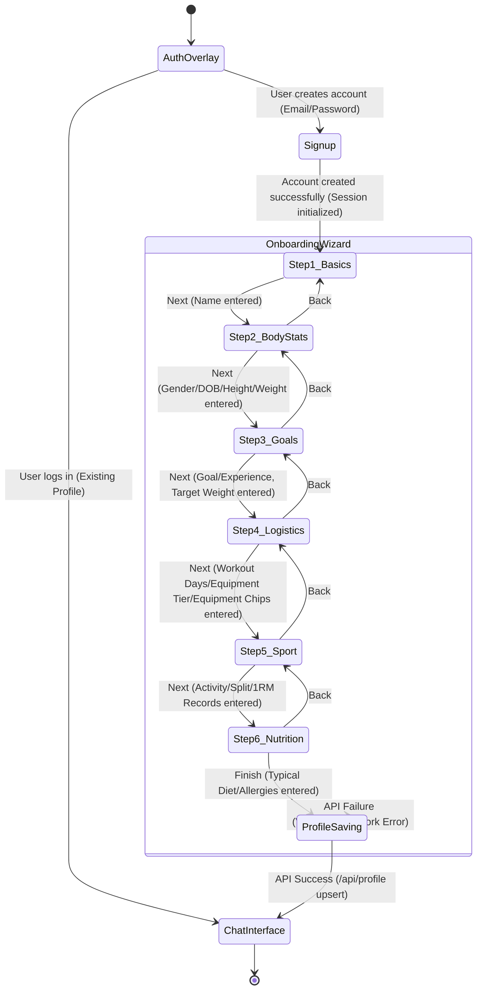

## 2. Live Coach Repetition Tracking (MediaPipe)
Describes the tracking logic inside the `ExerciseEngine` and associated Profiles (`SquatProfile`, `PushupProfile`, `PullProfile`) inside `workout_coach.js`. Contains dynamic range calibration and cross-contamination filtering.

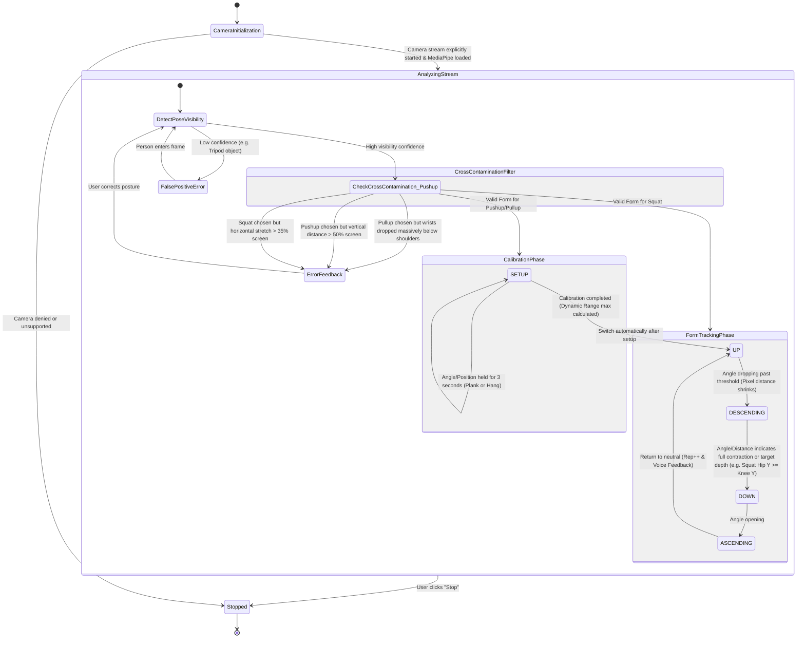

## 3. AI Agent Request State Machine
Describes the backend state machine running within Google's Agent Development Kit (ADK) Runner (`runners.py`) for processing a single user message. Includes 6 parallel context fetchers, 7 state_delta keys, and async locks.

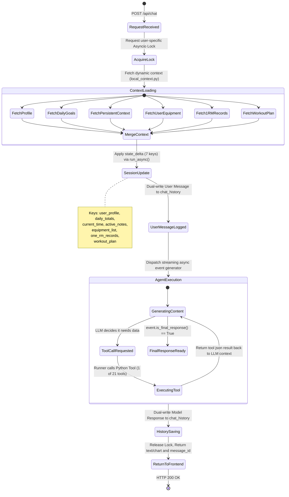

## 4. Message Feedback Flow
Describes the state of recording user sentiment and feedback on AI messages.

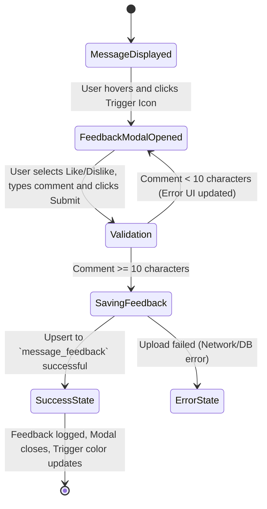

## 5. Client-Side Chat History Caching Flow
Describes how the frontend utilizes IndexedDB (`ChatCache`) to minimize backend fetch latency and DB load on page reloads.

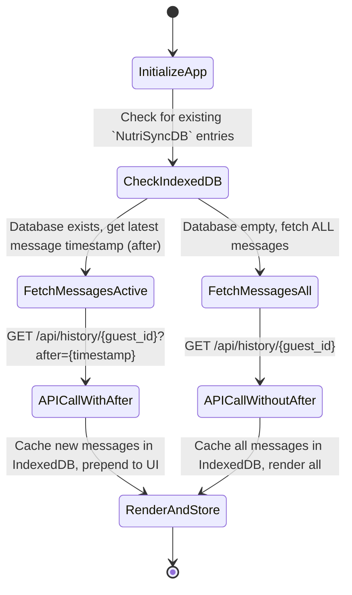

## 6. Workout Split Progression Logic
Describes the state flow internally managed when requesting the next workout (`get_next_workout` remotely via RPC).

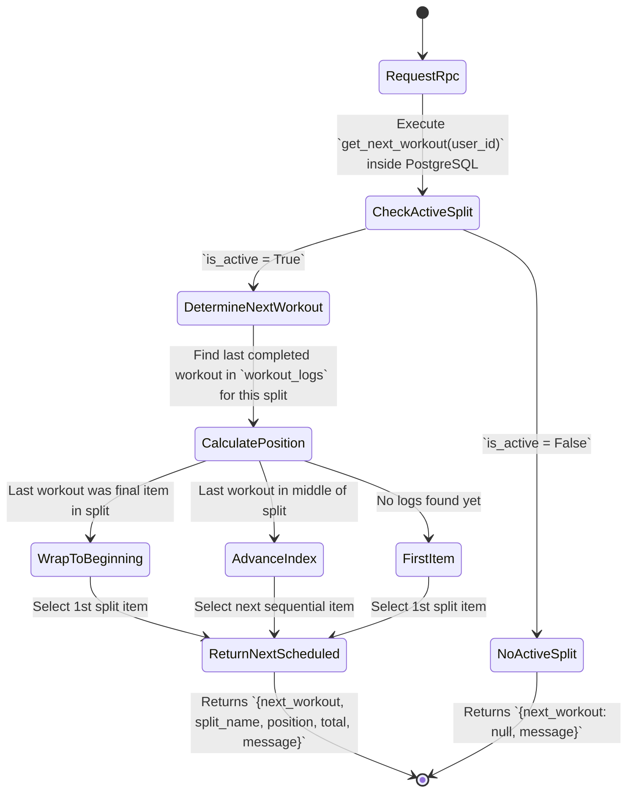

## 7. Health Score Snapshot Generation Flow
Describes the on-demand generation of user improvement scores. The AI Agent uses the `get_health_scores` tool which delegates the logic to a Supabase Edge Function to compute moving averages and write snapshots.

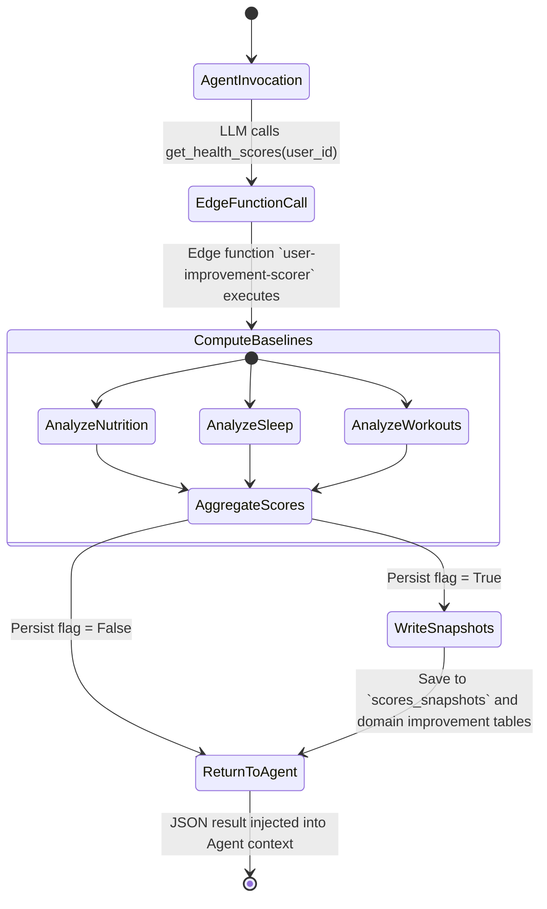

## 8. AI Workout Plan Generation Flow
Describes the state machine when the AI agent generates a structured workout plan. The agent selects exercises based on user context (profile, equipment, 1RM, split) and calls `generate_workout_plan` to persist the plan.

```mermaid
stateDiagram-v2
  [*] --> TriggerDetected

  TriggerDetected --> ContextGathered : Agent reads session state (profile, equipment, 1RM, active split)
  
  state ExerciseSelection {
    [*] --> IterateSplitDays : For each day in active split
    
    IterateSplitDays --> LookupMuscles : Map day name via SPLIT_MUSCLE_MAP (16 types)
    LookupMuscles --> SelectCompounds : Compounds FIRST (multi-joint)
    SelectCompounds --> SelectIsolations : Fill volume gaps with isolations
    SelectIsolations --> FilterByEquipment : Only exercises user can do with their equipment
    FilterByEquipment --> SetVolume : Apply Schoenfeld volume (MEV/MAV/MRV by experience)
    SetVolume --> SetRepRange : Apply goal-based rep range + load %1RM
    SetRepRange --> AssignSupersets : Group antagonist pairs (superset_group) if Arnold Split
    AssignSupersets --> SetRestPeriods : 120-180s compounds, 60-90s isolations
    SetRestPeriods --> IterateSplitDays : Next day
    SetRestPeriods --> BuildJSON : All days complete
  }
  
  ContextGathered --> ExerciseSelection
  
  BuildJSON --> CallTool : generate_workout_plan(exercises_json)
  
  state PersistPlan {
    [*] --> FetchActiveSplit : Get active split_id
    FetchActiveSplit --> DeleteOldPlan : Remove existing plan for this split
    DeleteOldPlan --> ValidateFields : Check 8 required fields per exercise
    ValidateFields --> BatchInsert : Insert all rows to workout_plan_exercises
    BatchInsert --> [*] : Return summary (exercises per day)
  }

  CallTool --> PersistPlan
  PersistPlan --> DisplayPlan : Agent presents plan to user
  DisplayPlan --> [*]
```

## 9. Set-Level Exercise Logging & PR Detection Flow
Describes the state machine when a user reports what they actually did in a workout. Includes the dual-tool workflow (session-level `log_workout` → set-level `log_exercise_sets`), PR detection, and auto 1RM updates.

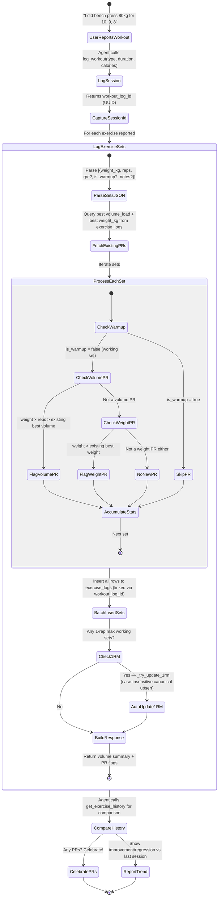

## 10. Progressive Overload Query Flow
Describes the two query modes for progressive overload analysis: single-exercise (uses DB function) and all-exercises (in-code aggregation).

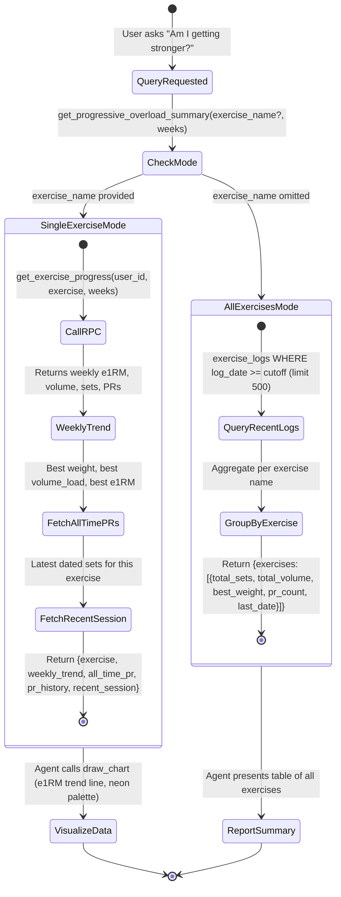

## 11. Muscle Volume Heatmap Query Flow
Describes how the weekly muscle volume data is computed by joining exercise logs with the workout plan to map exercises → target muscles.

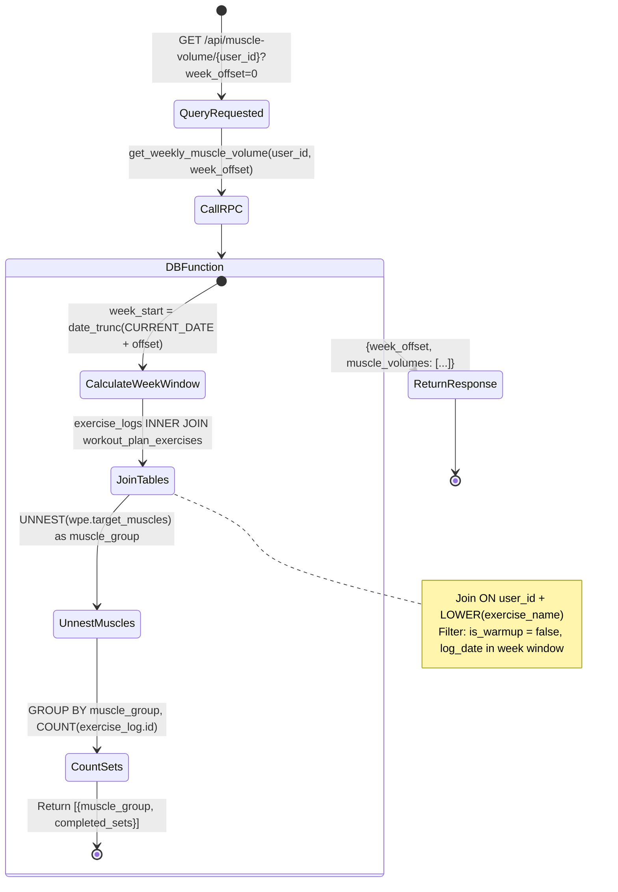
