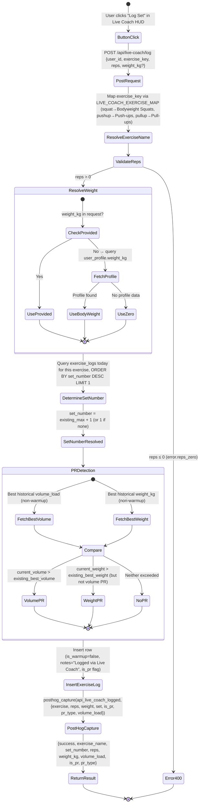
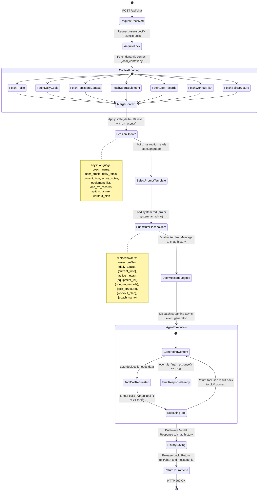
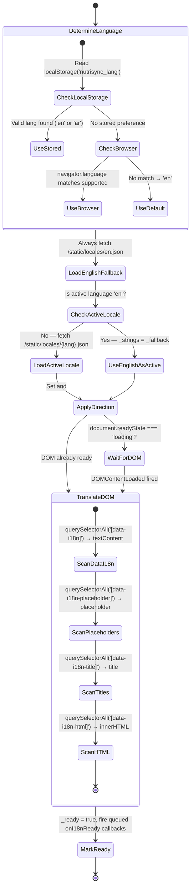

# NutriSync State Diagrams

This document contains text-based state diagrams (Mermaid) representing the actual runtime states and workflows within the NutriSync application.

## 1. User Onboarding Flow
Describes the multi-step wizard shown during initial account creation to capture physiological data and goals to formulate the user's macronutrients profile, save 1RM records, and persist granular equipment selections.

## 2. Live Coach Repetition Tracking (MediaPipe)
Describes the tracking logic inside the `ExerciseEngine` and associated Profiles (`SquatProfile`, `PushupProfile`, `PullProfile`) inside `workout_coach.js`. Contains dynamic range calibration and cross-contamination filtering.

## 3. Live Coach API Exercise Logging Flow
Describes the server-side flow when the frontend Live Coach UI submits a completed set via `POST /api/live-coach/log` (defined in `main.py`). This is independent of the AI agent — it writes directly to `exercise_logs` with auto set numbering, body-weight resolution, and PR detection.

## 4. AI Agent Request State Machine
Describes the backend state machine running within Google's Agent Development Kit (ADK) Runner (`runners.py`) for processing a single user message. Includes 7 parallel context fetchers, 10 state_delta keys, language-aware prompt loading, and async locks.

## 5. Message Feedback Flow
Describes the state of recording user sentiment and feedback on AI messages.

## 6. Client-Side Chat History Caching Flow
Describes how the frontend utilizes IndexedDB (`ChatCache`) to minimize backend fetch latency and DB load on page reloads.

## 7. Workout Split Progression Logic
Describes the state flow when the agent queries the next workout via the `get_next_scheduled_workout` tool (which internally calls the `get_next_workout` PostgreSQL RPC).

## 8. Health Score Snapshot Generation Flow
Describes the on-demand generation of user improvement scores. The AI Agent uses the `get_health_scores` tool which delegates the logic to a Supabase Edge Function to compute moving averages and write snapshots.

## 9. AI Workout Plan Generation Flow
Describes the state machine when the AI agent generates a structured workout plan. The agent selects exercises based on user context (profile, equipment, 1RM, split) and calls `generate_workout_plan` to persist the plan.

## 10. Set-Level Exercise Logging & PR Detection Flow
Describes the state machine when a user reports what they actually did in a workout. Includes the dual-tool workflow (session-level `log_workout` → set-level `log_exercise_sets`), PR detection, and auto 1RM updates.

```mermaid
stateDiagram-v2
  [*] --> UserReportsWorkout : "I did bench press 80kg for 10, 9, 8"

  UserReportsWorkout --> LogSession : Agent calls log_workout(type, duration, calories)
  LogSession --> CaptureSessionId : Returns workout_log_id (UUID)
  
  state SplitAdvanceSideEffect {
    [*] --> FetchActiveSplit : Query workout_splits WHERE is_active = True
    FetchActiveSplit --> NoSplit : No active split
    FetchActiveSplit --> FetchSplitItems : Active split found (split_id, last_completed_order_index)
    FetchSplitItems --> MatchWorkoutType : _normalize_day_name strips ordinal suffixes (1st, 2nd…)
    MatchWorkoutType --> NoMatch : workout_type doesn't match any split_items
    MatchWorkoutType --> DisambiguateDuplicates : Collect all matching positions
    DisambiguateDuplicates --> PickNextAfterLast : Choose first match with order_index > last_completed
    DisambiguateDuplicates --> WrapToFirst : All matches ≤ last_completed → wrap around
    PickNextAfterLast --> CallAdvanceRPC : advance_split_position(user_id, order_index)
    WrapToFirst --> CallAdvanceRPC
    CallAdvanceRPC --> [*]
    NoSplit --> [*]
    NoMatch --> [*]
  }

  CaptureSessionId --> SplitAdvanceSideEffect : Non-fatal side effect
  SplitAdvanceSideEffect --> LogExerciseSets : For each exercise reported
  
  state LogExerciseSets {
    [*] --> ParseSetsJSON : Parse [{weight_kg, reps, rpe?, is_warmup?, notes?}]
    ParseSetsJSON --> FetchExistingPRs : Query best volume_load + best weight_kg from exercise_logs
    
    FetchExistingPRs --> ProcessEachSet : Iterate sets
    
    state ProcessEachSet {
      [*] --> CheckWarmup
      CheckWarmup --> SkipPR : is_warmup = true
      CheckWarmup --> CheckVolumePR : is_warmup = false (working set)
      
      CheckVolumePR --> FlagVolumePR : weight × reps > existing best volume
      CheckVolumePR --> CheckWeightPR : Not a volume PR
      CheckWeightPR --> FlagWeightPR : weight > existing best weight
      CheckWeightPR --> NoNewPR : Not a weight PR either
      
      FlagVolumePR --> AccumulateStats
      FlagWeightPR --> AccumulateStats
      NoNewPR --> AccumulateStats
      SkipPR --> AccumulateStats
      AccumulateStats --> [*] : Next set
    }
    
    ProcessEachSet --> BatchInsertSets : Insert all rows to exercise_logs (linked via workout_log_id)
    BatchInsertSets --> Check1RM : Any 1-rep max working sets?
    Check1RM --> AutoUpdate1RM : Yes — _try_update_1rm (case-insensitive canonical upsert)
    Check1RM --> BuildResponse : No
    AutoUpdate1RM --> BuildResponse
    BuildResponse --> [*] : Return volume summary + PR flags
  }
  
  LogExerciseSets --> CompareHistory : Agent calls get_exercise_history for comparison
  CompareHistory --> CelebratePRs : Any PRs? Celebrate!
  CompareHistory --> ReportTrend : Show improvement/regression vs last session
  CelebratePRs --> [*]
  ReportTrend --> [*]
```

## 11. Progressive Overload Query Flow
Describes the two query modes for progressive overload analysis: single-exercise (uses DB function) and all-exercises (in-code aggregation).

## 12. Muscle Volume Heatmap Query Flow
Describes how the weekly muscle volume data is computed by joining exercise logs with the workout plan to map exercises → target muscles.

## 13. i18n Initialization Flow
Describes how the client-side internationalization engine (`i18n.js`) bootstraps on page load, determining the active language and translating the DOM.

## 14. Language Switch Flow
Describes the runtime state transition when a user changes language via the language switcher dropdown. Affects frontend DOM, CSS direction, localStorage, API payloads, and backend prompt selection.

```mermaid
stateDiagram-v2
  [*] --> UserSelectsLanguage : Change <select id='lang-switcher'>

  UserSelectsLanguage --> ValidateLang : setLang(newLang) called
  ValidateLang --> FallbackToEn : Unsupported language code
  ValidateLang --> PersistChoice : Valid ('en' or 'ar')
  FallbackToEn --> PersistChoice : Use 'en'

  PersistChoice --> SaveLocalStorage : localStorage.setItem('nutrisync_lang', lang)
  SaveLocalStorage --> FetchLocale : fetch /static/locales/{lang}.json

  FetchLocale --> UpdateStrings : Success — _strings = parsed JSON
  FetchLocale --> UseFallback : Failure — _strings = _fallback (English)

  UpdateStrings --> ApplyHTMLDirection : Set <html dir='rtl/ltr'> and <html lang>
  UseFallback --> ApplyHTMLDirection

  ApplyHTMLDirection --> RetranslateDOM : Scan all data-i18n* elements

  state CSSReaction {
    [*] --> LogicalPropertiesFlip : margin-inline-start, inset-inline-end etc. auto-flip
    LogicalPropertiesFlip --> RTLOverrides : [dir=rtl] rules activate (Cairo font, bg-position)
    RTLOverrides --> [*]
  }

  RetranslateDOM --> CSSReaction : Browser re-renders with new dir attribute
  
  CSSReaction --> DispatchEvent : CustomEvent('languagechange', {lang, dir})

  state ModuleReactions {
    [*] --> ScriptJSReacts : script.js updates dynamic text, Chart.js RTL options
    [*] --> WorkoutCoachReacts : workout_coach.js updates HUD text, canvas direction
  }

  DispatchEvent --> ModuleReactions

  ModuleReactions --> NextChatPayload : Subsequent /api/chat sends {language: newLang}
  NextChatPayload --> BackendPrompt : runners.py reads state.language → loads system_{lang}.md
  BackendPrompt --> AIRespondsInLanguage : Agent uses Arabic or English system prompt
  AIRespondsInLanguage --> [*]
```

